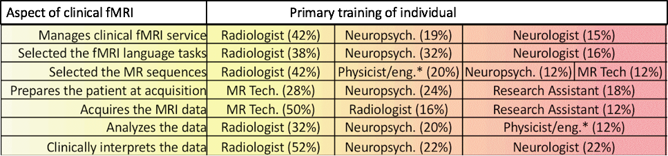

```{r setup, include=FALSE}
knitr::opts_chunk$set(echo = TRUE)
```

As tools and data primarily used by researchers move into the hands of clinicians, such tools and data must be made readily accessible and easy to use. Visualizations and graphics, acting as an index and accommodated by brief descriptors, are a powerful method to allow clinicians readily access and understand large data.

### Who's using the data?

There's a diversity of backgrounds among those using this data for clinical purposes.

```{r pressure, echo=FALSE, fig.cap="Come back to for editing", out.width = '100%'}

```


```{r, include = FALSE}
"This table displays what types of professionals are utlizing fMRI data for clinical usage. It may be assummed not all backgrounds are trained fully navigating and interpreting large MRI databases."
```

Benjamin et al., 2018. Presurgical language fMRI: Current technical practices in epilepsy surgical planning. **Review ongoing**


### How can we make it transferable?

A tree diagram, interactive and visualizing standardized output, has potential to make large data easily understood

Presented at Brainhack 2018 at the Child Mind Institute in NYC

Presented by Noah Markowitz | noahb.markowitz@gmail.com
